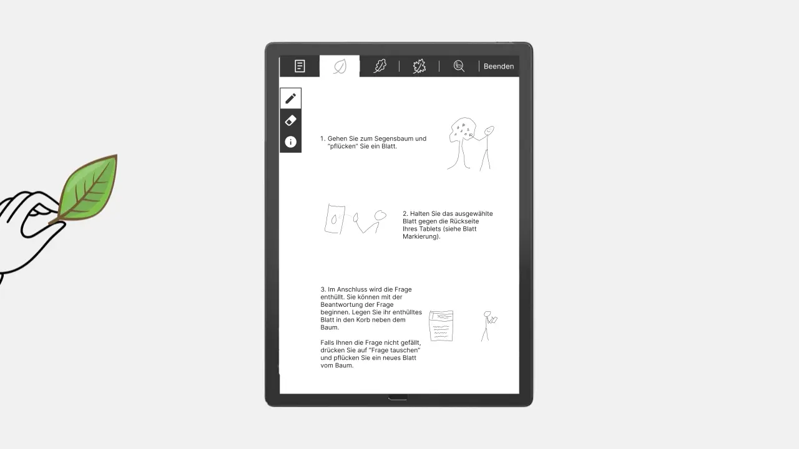

# Expo-companion
This repo holds the source code my the HCI-Project course at [JMU Würzburg](https://www.uni-wuerzburg.de/)
The ExpoCompanion is a tool for religious educators was developed to support them at an exhibition,
in reflecting on the use of interactive technologies in the field of teaching and learning about religious topics.
Through an iterative design process, the "ExpoCompanion" emerged. An app on an e-paper tablet that allows teachers to "reveal"
and answer questions stored on sheets with NFC tags.
The focus during development was on meeting the needs of stimulation, autonomy, and competence for the teachers.

## Description
The ExpoCompanion consists of an Android app running on an [Onxy Max Lumi 2](https://onyxboox.com/boox_maxlumi2) e-paper tablet with a usb  and a 
[Pocketbase](https://pocketbase.io/) backend to handle the data storage. 
The Android app is written in kotlin using the [Jetpack Compose](https://developer.android.com/jetpack/compose) UI Framework

## Visuals

## Installation

### Prerequisites for the app

- JVM
- Android Studio
- [Onxy Max Lumi 2](https://onyxboox.com/boox_maxlumi2) (the app only runs on the actual hardware due to the custom e-paper writing logic)
- patience

### Prerequisites Pocketbase backend

- GoLang

## Usage

- To use the app, spin up the backend
- modify the [url in the RetroFitClient](/frontend/app/src/main/java/com/example/expo_companion/network/client/RetroFitClient.kt)
- Connect the tablet to the internet

